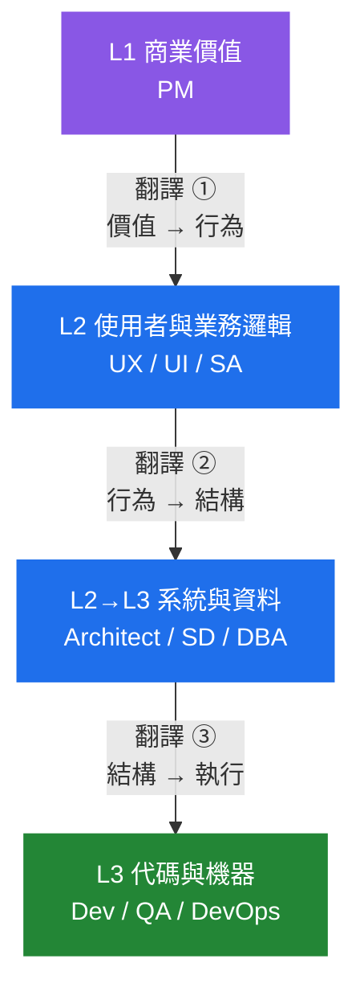
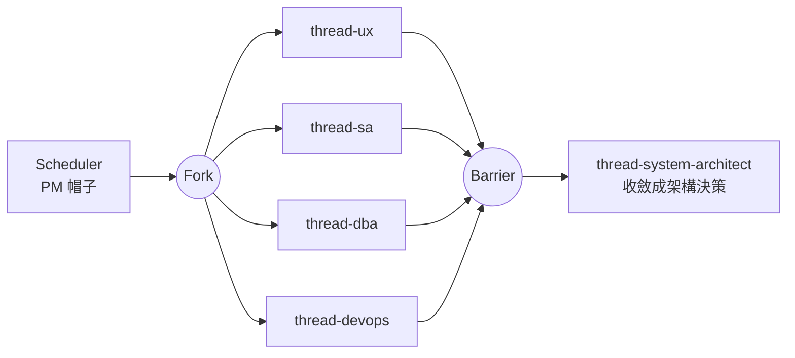

# 角色模型（Role Model）

**角色是「負責哪一層的正確性」，執行單位是「怎麼跑」。兩者正交。**

一個角色可以由 Scheduler 自己戴帽子，也可以派成 Thread 或 Process——決定的是隔離買不買得到東西（`rules/dispatch.md`），不是角色本身。

---

## 一、越上游越抽象，越下游越具體



**三個翻譯邊界就是三道 Gate。** 跳過任何一道，下游會拿到一份自己補完的假需求。

這與 `rules/register.md` 是同一件事：**L1 與 L3 之間唯一合法的通道是 L2。** 直接把商業目標丟給 Dev，等於要求他自己發明業務規則。

---

## 二、十個角色

| # | 角色 | 負責哪一層的正確性 | 一句話 | 主要交付物 |
|---|---|---|---|---|
| 1 | **PM** | 商業價值 | 為什麼要做 | 問題陳述、成功條件、範圍與**不做什麼** |
| 2 | **UX** | 使用者行為 | 使用者怎麼走 | 使用流程、關鍵路徑、失敗與空狀態 |
| 3 | **UI** | 視覺呈現 | 長什麼樣 | 介面規格、狀態、一致性規則 |
| 4 | **SA** | 業務規則 | 系統怎麼判斷 | 規則表、判定條件、例外與邊界 |
| 5 | **Architect** | 系統演進 | 系統怎麼活下去 | 架構決策、擴展性、取捨總表 |
| 6 | **SD** | 開發落地 | 模組怎麼長 | 模組邊界、測試接縫、垂直切片 |
| 7 | **DBA** | 資料正確性 | 資料怎麼存 | 資料模型、索引、遷移與一致性保護 |
| 8 | **Dev** | 實作正確性 | 真的把它做出來 | 可運行的程式與與風險相稱的驗證 |
| 9 | **QA** | 結果正確性 | 確認沒壞 | Spec 軸與 Standards 軸的 Finding |
| 10 | **DevOps / SRE** | 上線運行 | 活著 | 部署、監控、告警、回滾路徑 |

---

## 三、角色 × 執行單位

**不是每個角色都要派一個 Agent。** 判準仍然是 `rules/dispatch.md` 第 1 條：隔離買到什麼？

| 角色 | 執行單位 | 為什麼 |
|---|---|---|
| **PM** | Scheduler 戴帽子 ＋ `se-clarify` / `se-feasibility` | 它的工作是**跟人對話**（GIL），不是被派出去的計算 |
| **UX / UI** | `thread-ux` | 唯讀分析既有流程與介面慣例，可與其他分析平行 |
| **SA** | `thread-sa` | 唯讀梳理業務規則與例外，產出規則表 |
| **Architect** | `thread-system-architect` | 唯讀第二意見，用最強推理配置 |
| **SD** | Scheduler 戴帽子 ＋ `se-design` | 接縫與切片必須跟人確認過才算數 |
| **DBA** | `thread-dba` | 唯讀稽核資料模型與查詢，有自己的檢查表 |
| **Dev** | `process-worker` | **要寫工作樹** → 完整隔離 |
| **QA** | `thread-reviewer-spec` ＋ `thread-reviewer-standards` | 兩軸必須互相隔離、首輪不互看 |
| **DevOps / SRE** | `thread-devops` | 唯讀評估部署與可觀測性就緒度 |

### 可以平行的角色

UX、SA、DBA、DevOps 的分析階段**寫入範圍不相交**，屬於同一個 Thread Pool：



**Architect 必須在 Barrier 之後**——它要看齊全部四份分析才能做取捨。

---

## 四、AI 改變了哪兩層

```
Dev    AI 可以幫你寫大部分的 code
QA     AI 可以生成測試案例
────────────────────────────────  以上兩層被大幅改變
其餘八層幾乎沒變
```

**因為那八層做的是「定義問題」與「控制複雜度」。**

這對這套配置的直接影響：

| 影響 | 落地 |
|---|---|
| 上游角色的產出品質決定 AI 用得好不好 | 三道翻譯 Gate 不可跳過 |
| Dev 層變便宜 → 瓶頸移到「有沒有定義清楚」 | `se-clarify` 與 `se-design` 的接縫確認比以前更重要 |
| 生成量變大 → 驗證成本上升 | QA 兩軸不合併、`process-worker` 不得自我核准 |
| 上游決策一錯，下游高速產出錯的東西 | `evidence-grades`：估算與實測措辭必須分開 |

**這不是「AI 取代下游」，是「上游的錯誤被放大得更快」。**

---

## 五、交接契約

每個角色往下游交付時，附三件事。缺任何一件，下游只能自己補完——而補完的內容沒有人審過。

```
1 產出        這一層負責的正確性，具體寫出來
2 未決        我沒決定的事，以及誰該決定
3 假設        我為了往下走而假設的事，錯了要重做什麼
```

**「未決」與「假設」是兩件事**：未決是還沒有人決定，假設是我先決定了但沒人確認。混在一起，下游會把假設當成已核准。

跨 Process 的交接走 `templates/HANDOFF.md`；角色層的交接寫進該角色的交付物本身。

---

## 六、什麼時候不要跑完十個角色

**不是每個專案都需要十個角色。** 雛型期跑完十個角色是最典型的過度治理（`rules/thinking-boundary.md`）。

| 情境 | 至少要有 |
|---|---|
| 個人雛型、驗證想法 | PM（為什麼做）＋ Dev ＋ 一個可跑的檢查 |
| 有人要接手 | ＋ SA（規則寫下來）＋ SD（接縫）＋ QA |
| 有使用者介面 | ＋ UX |
| 有持久化資料 | ＋ DBA（**資料模型改起來最貴**） |
| 要上線且要活著 | ＋ Architect ＋ DevOps |

判準一句：**這個角色不做，會由誰在什麼時候用什麼代價補？** 答得出「沒人、不用補」就跳過。

完整流程見 [`skills/se-sdlc/SKILL.md`](skills/se-sdlc/SKILL.md)。
