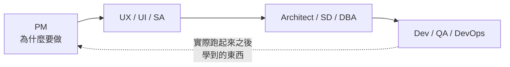

# SDLC — 十角色分工

角色定義、層級與執行單位對照見 [`../../ROLE_MODEL.md`](../../ROLE_MODEL.md)。本檔是**操作程序**。

進入本 skill 時，你是 **Scheduler**，同時戴 **PM 與 SD** 兩頂帽子（那兩個角色的工作是跟人對話與確認，不是被派出去的計算）。

---

## 核心：三道翻譯 Gate

```
L1 商業價值（PM）
   ↓ Gate A  價值 → 行為：講得出使用者做了什麼、看到什麼
L2 使用者與業務邏輯（UX / UI / SA）
   ↓ Gate B  行為 → 結構：講得出系統怎麼判斷、資料怎麼存
L2→L3 系統與資料（Architect / SD / DBA）
   ↓ Gate C  結構 → 執行：講得出模組邊界、測試接縫、上線條件
L3 代碼與機器（Dev / QA / DevOps）
```

**跳過任何一道，下游會自己補完——而補完的內容沒有人審過。**

這是 `rules/register.md` 的落地：L1 與 L3 之間唯一合法的通道是 L2。**直接把商業目標丟給 Dev，等於要求他自己發明業務規則。**

---

## Phase 0 — 決定要跑哪幾個角色

**不是每個專案都要十個角色。** 雛型期跑完十個是最典型的過度治理。

先問一句，逐個角色套：

> **這個角色不做，會由誰、在什麼時候、用什麼代價補？**

答得出「沒人、不用補」就跳過，並**在計畫裡明寫跳過了誰、為什麼**——不寫的話，下游會以為那份產出存在。

| 情境 | 至少要有 |
|---|---|
| 個人雛型、驗證想法 | PM ＋ Dev ＋ 一個可跑的檢查 |
| 有人要接手 | ＋ SA ＋ SD ＋ QA |
| 有使用者介面 | ＋ UX |
| 有持久化資料 | ＋ DBA（**資料模型改起來最貴**） |
| 要上線且要活著 | ＋ Architect ＋ DevOps |

---

## Phase 1 — PM：為什麼要做（Scheduler 戴帽子）

**這一層答不出來，後面九層都是在高速做錯的東西。**

```
1 問題      誰的什麼痛點？現在他怎麼解決？
2 價值      做完之後，什麼可觀察的事情會不同？
3 成功條件  3–5 條可檢查的，不是「做得好」
4 不做什麼  明確寫下 Out of Scope
5 誰拍板    範圍與優先序由誰決定
```

答不出第 1 或第 2 題 → 載入 `se-clarify`。
不確定值不值得投入 → 載入 `se-feasibility`。

**「不做什麼」最常被跳過，但它是後面所有角色的邊界。**

### Gate A — 價值 → 行為

過關條件：**講得出使用者實際做了什麼、看到什麼。**

- ❌「提升轉換率」— 這是價值，不是行為
- ✅「使用者在結帳頁可以直接改數量，不用回購物車」

講不出來就不要往下——UX 與 SA 會各自猜一套，而且猜的方向不同。

---

## Phase 2 — 並行分析（Thread Pool）

UX、SA、DBA、DevOps 的分析**寫入範圍不相交**，可以同時派：

```
Fork → thread-ux · thread-sa · thread-dba · thread-devops → Barrier
```

**Architect 必須在 Barrier 之後**——它要看齊四份分析才能做取捨。這是真依賴，不是鎖。

| Thread | 產出 | 一句話判準 |
|---|---|---|
| `thread-ux` | 主要流程、關鍵路徑、**失敗與空狀態** | 使用者卡住的時候看到什麼 |
| `thread-sa` | 規則表、判定條件、**例外與邊界** | 系統依什麼判斷，模糊地帶怎麼辦 |
| `thread-dba` | 資料模型、索引、**遷移與一致性保護** | 一列代表什麼，什麼絕對不能違反 |
| `thread-devops` | 部署方式、監控指標、**回滾路徑** | 壞掉的時候誰知道、怎麼退回去 |

**四個都要求交出「未決」與「假設」兩節**（`ROLE_MODEL.md` 的交接契約）。混在一起的話，下游會把假設當成已核准。

### Gate B — 行為 → 結構

過關條件：

- [ ] 每條使用流程都有對應的業務規則，**沒有「這裡再看看」**
- [ ] 每條不變量（invariant）都有資料層的保護機制
- [ ] 失敗路徑與空狀態有明確定義，不是等 Dev 自己決定
- [ ] 未決事項有指定的決定者與期限

---

## Phase 3 — Architect：系統怎麼活下去

收斂四份分析，產出架構決策。**完整九階段見 `se-system-design`**；本 skill 只要求三件產出：

1. **第一個瓶頸假設**（一句話，先估數字再選架構）
2. **每條 Invariant → 保護機制對照**
3. **取捨總表**：決策／選擇／放棄了什麼／什麼情況要重評

派 `thread-system-architect`，或在需求規模小時由 Scheduler 直接載入 `se-system-design` 走 Stage 0–2。

---

## Phase 4 — SD：模組怎麼長（Scheduler 戴帽子）

載入 `se-design`。兩件不能跳過：

| 步驟 | 規則 |
|---|---|
| **定接縫** | 沿用既有 > 新開；用**能觀測到行為的最高**接縫；越少越好。**先跟人確認再寫第一個測試** |
| **切片** | 縱切穿過所有層。四判準：完整、可獨立驗證、裝得進一個新 Process、接縫已定 |

**接縫必須跟人確認過。** 沒確認的接縫產出的是沒人要的測試。

### Gate C — 結構 → 執行

過關條件：

- [ ] 每個 Process 有交付成果、驗收條件、寫入鎖
- [ ] 測試接縫已確認，不是「到時候再說」
- [ ] `Depends on` 只含真依賴；寫入衝突標成 Mutex
- [ ] 上線條件（DevOps 的產出）已知，不是等做完才想

過關後交給 `se-scheduling` 建 Ready Queue 並派發。

---

## Phase 5 — Dev / QA / DevOps

| 角色 | 執行單位 | 紀律 |
|---|---|---|
| **Dev** | `process-worker` | 爬最小實作階梯；**不得自我核准**；凍結 Snapshot 後回報 |
| **QA** | `thread-reviewer-spec` ＋ `thread-reviewer-standards` | 兩軸同時派、**首輪不互看**、分開報不排名 |
| **DevOps** | `thread-devops` 複驗 | 監控、告警 owner、回滾**演練過**才算數 |

**驗證必須碰到交付物本身**——跑真正的指令，讀真正的輸出。

---

## Phase 6 — 回到 PM



上線不是終點。**回到 PM 檢查：當初的成功條件成立了嗎？**

- 成立 → 下一輪的範圍
- 不成立 → 是價值判斷錯、行為定義錯，還是實作錯？**這個歸因決定下次哪一層要多花時間**
- 無論成不成立 → `se-epiphany` 留一則 Lesson

---

## AI 時代的重點在哪一層

**AI 大幅改變的只有 Dev 與 QA 兩層；其餘八層幾乎沒變，因為那些是「定義問題」與「控制複雜度」的工作。**

實務結論不是「上游更輕鬆」，而是相反：

| 變化 | 後果 |
|---|---|
| Dev 層變便宜 | 瓶頸移到「有沒有定義清楚」 |
| 生成量變大 | 驗證成本上升，QA 兩軸更不能合併 |
| 上游一錯 | **下游高速產出錯的東西** |

**這不是 AI 取代下游，是上游的錯誤被放大得更快。** 三道翻譯 Gate 的價值因此變高，不是變低。

---

## 反模式

| 反模式 | 改成 |
|---|---|
| 直接從 PM 跳到 Dev | 至少補 SA（規則）與 SD（接縫），否則 Dev 在發明業務規則 |
| 十個角色全跑一遍才開始 | Phase 0 逐個問「不做會由誰補」，跳過的要寫下來 |
| UX 與 SA 串成 `Depends on` | 它們寫入範圍不相交，是 Thread Pool 不是依賴鏈 |
| Architect 跟四份分析平行跑 | 它要看齊才能取捨，這是真依賴 |
| 「未決」與「假設」寫在一起 | 分開。下游會把假設當成已核准 |
| 上線就結束 | 回到 PM 檢查成功條件，並歸因到哪一層 |
| 雛型期跑完整十角色 | `rules/thinking-boundary.md`：雛型期走 happy path |

## 完成條件

- Phase 0 已決定跑哪幾個角色，**跳過的有寫下來與理由**。
- 三道翻譯 Gate 逐一過關，沒有「下游自己補」的缺口。
- 每個角色的交付都含**產出／未決／假設**三節。
- 每條 Invariant 有對應的保護機制。
- 接縫已跟人確認，切片通過四判準。
- 回到 PM 檢查過成功條件，並留下一則 Lesson。
