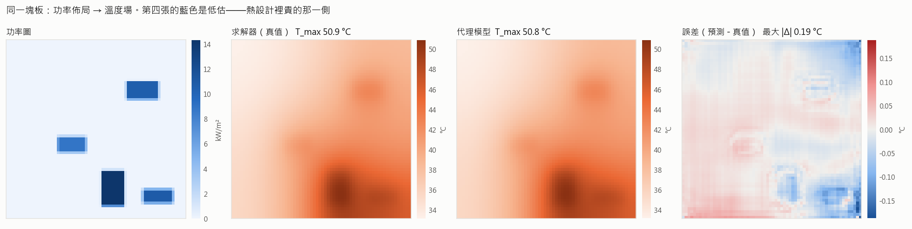
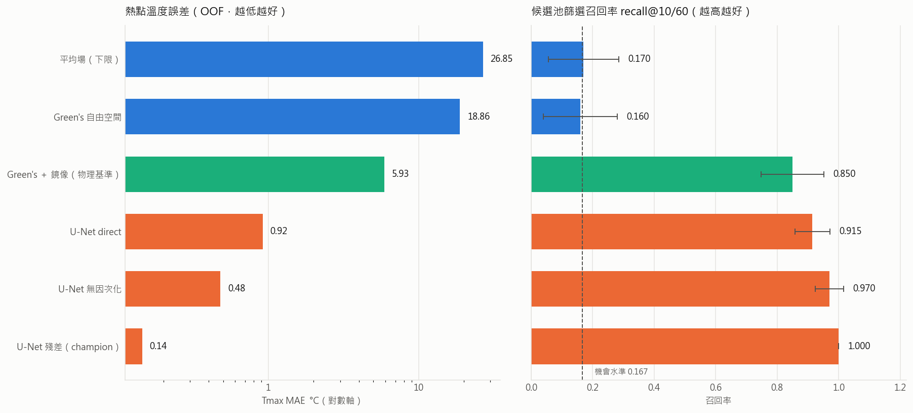
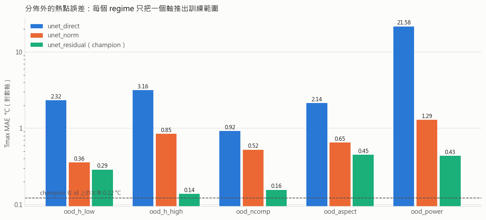
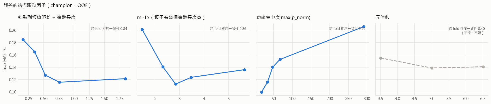

<div align="center">

# ThermoForge

**板級熱設計的秒級代理模型 × 物理一致性檢查 × 一個不替你編數字的 LLM 設計副駕**

一個把「這個分數可不可信」看得比「這個分數高不高」更重要的物理 AI 專案。

[](https://github.com/cdexswzaq0110/ThermoForge/actions/workflows/ci.yml)
[](LICENSE)

</div>

> CI 跑兩件不同的事：**單元測試**（呼叫函式）與**端到端煙霧測試**（跑整條 CLI，
> 用 48 列的迷你資料集）。分開是因為它們的失敗方式不重疊——CLI 參數或設定檔壞掉時，
> 單元測試會全部是綠的。

---

## 證據邊界（請先讀這一段）

訓練資料由本 repo 內建的**二維穩態熱傳導有限差分求解器**生成，不是 CFD。
它不解流場、不算輻射、不做暫態、不處理三維堆疊與散熱片。

**本專案能證明的是「代理模型學不學得會這個求解器、在分佈外會不會崩、崩在哪」，
不是「能不能取代 FloTHERM／Icepak」。**

而且求解器本身只要 **0.263 ms**（DCT 對角化），代理模型是 0.32 ms——
**在本 repo 內，代理模型沒有速度優勢**。速度論證只在 ground truth 昂貴時成立，
而那個情況本 repo 沒有證據。詳見 [docs/02-solver.md](docs/02-solver.md) 的誠實段落。

便宜的求解器不是缺點，是刻意的方法學選擇：ground truth 便宜到可以無限生成，
才量得出**精確的**外推誤差與**精確的**守恆殘差——那些量在 ground truth
一筆要跑四個 CPU 小時的時候根本量不出來。

---

## 這個專案在解什麼

熱設計工程師在佈局定案前要決定「這個元件擺放方案值不值得送 CFD 驗證」。
真正的設計空間大到 10⁶ 以上，而一輪迭代只試得起個位數方案。

代理模型接手的是**篩選**，不是**判定**：

```
1000 個候選佈局
   → 代理模型秒級掃過，依熱點溫度排序        ← 本專案負責這一段
   → 取前 20 個送求解器 / CFD 確認            ← 判定仍由數值方法做
   → 工程師從確認過的結果裡挑
```

所以「篩選階段沒把好方案漏掉」比「溫度預測絕對準」更重要，而且
**低估熱點遠比高估貴**——低估會讓過熱的板子一路走到量產。
這兩句決定了本專案的每一個 metric。



---

## 三個設計決定，每一個都可以被戳破

### 一、Baseline 是物理解，不是平均值

這個方程有解析 Green's function `K₀(m·r)/(2π)`，所以「一個懂熱傳的工程師手算的近似解」
是一個真實而且很強的對手。拿「預測訓練集平均場」當基準是自欺。

實測：物理基準（Green's ＋ 一階鏡像）在候選池裡拿到 **0.850** 的篩選召回率
（機會水準 0.167）。神經網路要贏的是這個，不是 0.170 的 dummy。

自由空間版本的整場 MAE **比 dummy 還差**（14.6 vs 6.6 °C）——因為它忽略邊界，
在受限的板子上系統性低估。這個弱點被寫成測試釘住，而不是等比較表出來才發現。

### 二、主要 metric 一開始是壞的，而且從定義上看不出來

原本直接在一般資料集上算篩選召回率。跑一個**完全不看佈局**的預測器去打它：

| 預測器 | recall@20/200 |
|---|---|
| `T_amb + P/(h·A)`——只用能量守恆，不看任何佈局 | **0.609 ± 0.088** |
| 隨機排序 | 0.108 ± 0.066 |
| 機會水準 | 0.100 |

**六成的分數與模型無關。** 原因是候選之間的板子、功率、散熱條件都不同，
排序主要由功率密度決定，而不是擺放。

修的是**評估場景**不是指標：候選池改成「板子、元件清單、功率預算、散熱方案全部固定，
只換元件位置」——真實設計迭代的樣子。於是那個作弊預測器退化成隨機（0.170 vs 機會 0.167）。
池內熱點溫差中位數 **23.6 °C**，那才是這個工具要抓的訊號。

→ [L0001：決策型指標定案前，先寫一個作弊 baseline 去打它](docs/lessons/0001-metric-saturation-needs-a-cheating-baseline.md)

### 三、LLM 不產生數字

設計副駕裡，語言模型只做一件事：把「CPU 拉到 60 W 還安全嗎」翻成結構化查詢。
**溫度、餘裕、建議全部來自一次實際的代理模型呼叫**，而且要通過分佈檢查才會被當成數字報出去。

推出訓練分佈的查詢不會得到一個「比較不確定」的數字，會得到**未驗證**、
點名是哪一軸出界、以及「這題要送 CFD」。外推區沒有證據，任何數字都是編的。

---

## 結果

完整表格、判定與跨 seed 穩定性在 [docs/05-results.md](docs/05-results.md)。

<!-- BEGIN generated:results -->

### 候選比較（id-val 的 OOF ＋ pool-dev）

| 候選 | OOF field MAE | OOF Tmax MAE | Tmax bias | 低估率 | 低估 p95 | 池內 recall@10/60 | 推論 ms/佈局 |
|---|---|---|---|---|---|---|---|
| A — 平均場（下限） | 6.552 | **26.851** | -26.845 | 99.2% | 62.36 | **0.170 ± 0.114** | 0.01 |
| B — Green's 自由空間 | 14.646 | **18.863** | -18.863 | 99.5% | 44.50 | **0.160 ± 0.120** | 2.79 |
| B+ — Green's ＋ 一階鏡像（**物理基準**） | 5.252 | **5.927** | -5.927 | 90.2% | 17.35 | **0.850 ± 0.102** | 28.11 |
| C — U-Net direct（無因次化對照組） | 0.340 | **0.919** | +0.045 | 13.1% | 2.07 | **0.915 ± 0.057** | 0.30 |
| D — U-Net 無因次化 | 0.185 | **0.479** | -0.030 | 6.1% | 1.18 | **0.970 ± 0.046** | 0.32 |
| E — U-Net 殘差（**champion**） | 0.042 | **0.144** | +0.022 | 0.2% | 0.31 | **1.000 ± 0.000** | 0.30 |
| F — E ＋ 低估加權 3× | 0.053 | **0.233** | +0.180 | 0.1% | 0.17 | **0.985 ± 0.036** | 0.33 |
| unet_norm_s1 | 0.188 | **0.460** | -0.016 | 5.6% | 1.09 | **0.975 ± 0.043** | 0.28 |
| unet_residual_s1 | 0.044 | **0.175** | -0.003 | 0.7% | 0.39 | **0.990 ± 0.030** | 0.35 |

### 跨 seed 穩定性

| 候選 | seed | OOF Tmax MAE | fold 間標準差 | 池內 recall |
|---|---|---|---|---|
| unet_norm | 0 | 0.479 | 0.0736 | 0.970 ± 0.046 |
| unet_norm | 1 | 0.460 | 0.0805 | 0.975 ± 0.043 |
| unet_residual | 0 | 0.144 | 0.0087 | 1.000 ± 0.000 |
| unet_residual | 1 | 0.175 | 0.0200 | 0.990 ± 0.030 |

### Frozen holdout（解凍一次）

解凍時間 `2026-09-07T07:28:39Z`，commit `a85ac83`，champion `unet_residual`。

| regime（各推一軸） | unet_residual Tmax MAE | unet_direct Tmax MAE | unet_norm Tmax MAE |
|---|---|---|---|
| ood_h_low | 0.288 | 2.322 | 0.357 |
| ood_h_high | 0.138 | 3.163 | 0.847 |
| ood_ncomp | 0.156 | 0.921 | 0.524 |
| ood_aspect | 0.451 | 2.138 | 0.649 |
| ood_power | 0.435 | 21.577 | 1.291 |

| 低估率 | unet_residual | unet_direct | unet_norm |
|---|---|---|---|
| ood_h_low | 1.2% | 9.4% | 3.1% |
| ood_h_high | 0.0% | 62.5% | 11.2% |
| ood_ncomp | 0.0% | 5.0% | 0.0% |
| ood_aspect | 10.6% | 2.5% | 5.0% |
| ood_power | 5.0% | 95.6% | 16.9% |

**pool-frozen（20 個候選池，1200 列）**：recall@10/60 **0.965 ± 0.057**，field MAE 0.037 °C，Tmax MAE 0.204 °C，低估率 2.1%。

<!-- END generated:results -->



---

## 分佈外：五個 regime，每個只推一軸

`ood_h_low` / `ood_h_high`（熱擴散長度）· `ood_ncomp`（空間複雜度）·
`ood_aspect`（邊界形狀）· `ood_power`（功率尺度）。

一次只動一軸是刻意的：同時改三件事的話，模型崩掉之後無法歸因，
整個實驗只剩「會崩」這個沒有行動價值的結論。

`ood_power` 有特殊地位——方程對功率**線性**，所以正確答案已知：
做完無因次化的模型在那裡應該與 id 同分。它是一個**探針**，不是難度測試。
探針的結果：

| `ood_power` | Tmax MAE | 低估率 |
|---|---|---|
| U-Net direct（沒有無因次化） | **21.58 °C** | **95.6%** |
| U-Net 無因次化 | 1.29 °C | 16.9% |
| U-Net 殘差（champion） | **0.44 °C** | 5.0% |

沒有無因次化的模型在功率外推上完全崩掉，而且 95.6% 是**低估**——最貴的那個方向。
紙上推導說「無因次化會有幫助」；**幅度 16.7 倍是實測才知道的**。



champion 唯一明顯低估的 regime 是 `ood_aspect`（長寬比 1.6–2.4）：
低估率 10.6%、bias −0.33 °C。這一條寫進了 Model Card，副駕對超出 0.8–1.25 的
長寬比一律報未驗證。

**主要 metric 的最終數字**：pool-frozen（20 個從未看過的候選池）
**recall@10/60 = 0.965 ± 0.057**，對照 pool-dev 的 1.000。
dev 上的 1.000 是樂觀的——開發期反覆看的那個數字本來就會被看成最好的那個。

frozen holdout 的解凍需要 `--confirm`，而且每次都會在 `runs/frozen_ledger.jsonl`
留一列。擋不住的東西改成記錄下來，因為真正的風險不是有人偷看，是**忘記自己看過**。

---

## 可解釋性：問物理，不問特徵重要性

輸入是一張 64×64 的場，不是一組欄位。對 4096 個像素做 attribution 得到的是
「熱點附近的像素比較重要」——真的，但沒有資訊量，因為物理已經說了。

場預測有一個表格模型沒有的東西：**它應該滿足一個方程**。所以問法改成
「模型的輸出違反那個方程多少、違反在哪裡」。

| 診斷 | 問什麼 | 上線後算得出來嗎 |
|---|---|---|
| **PDE 殘差場** | 預測代回 ∇²θ − m²θ + f 等於零嗎 | ✅ 不需要真值 |
| **能量守恆誤差** | h·∫θ̂ dA 與總功率差多少 | ✅ 不需要真值 |
| **誤差的結構驅動因子** | 模型在哪一類佈局上會錯 | ❌ 需要真值，離線做 |

前兩個不需要真值，這對部署特別重要——**上線之後沒有真值，但這兩個量算得出來**。



三個穩定的驅動因子（跨 fold 排序一致性 0.84–0.90）指向**同一個物理情境**：
功率集中、板子只有一兩個熱擴散長度寬、熱點又貼著絕熱邊界——熱被困在一小塊區域裡。
第四個因子（元件數）的一致性只有 0.40，**低於 0.5 的門檻，所以不報**。

而且這三條在**干預**下也成立：在同一塊參考板上把 CPU 從貼邊移到中央，
代理模型的誤差從 +0.132 °C 掉到 +0.055 °C（[06](docs/06-interpretability.md) 第 6 節）。

最值得記的一條物理發現：**沒有任何損失項要求它守恆，但它學到了。**
Champion 的能量守恆誤差中位數是 **0.043%**，比它被訓練去修正的那個解析近似（16.3%）
好 380 倍。但 PDE 殘差中位數 0.47 不接近零——**它是代理模型，不是求解器**：
復現了解的積分性質與極值，沒有逐點滿足方程。

---

## 設計副駕

```bash
.venv/Scripts/python -m thermoforge.copilot --demo
```

實際輸出（節錄兩題）：

```
問題：如果把 CPU 從 25.5W 拉到 60W，還安全嗎？
改動：CPU 功率 → 60 W
總功率 107.5 W，熱擴散長度 53 mm
熱點溫度 143.9 °C【**未驗證**——不要拿這個數字做決定】
  · 熱點溫升（估計） = 105，訓練分佈只到 15–90
  · 這一軸有實測：`ood_power` regime（90–170）的 Tmax MAE 是 0.43 °C，低估率 5.0%
  → 這題要送求解器／CFD 確認再下結論；上面的實測數字說明風險量級，不是背書

問題：幫我把元件重新排一下，讓熱點低一點
現況熱點 88.7 °C【已確認：求解器】，上限 95 °C，餘裕 +6.3 °C
代理模型掃了 200 個佈局（只換位置，元件與散熱條件不變），前 3 名交給求解器確認：
  #1  代理模型 85.0 °C → 求解器 **85.0 °C**【已確認】，比現況低 3.7 °C
  #2  代理模型 86.1 °C → 求解器 **86.1 °C**【已確認】，比現況低 2.6 °C
  #3  代理模型 86.6 °C → 求解器 **86.5 °C**【已確認】，比現況低 2.2 °C
最佳建議把熱點降到 85.0 °C。這是**建議**不是最佳解證明——搜尋是隨機重啟，沒有收斂保證。
```

注意第一題：它**沒有**只說「未驗證」就收工。分佈外的那一軸如果有實測，
就把那個 regime 的實測誤差報出來——**「這裡沒有證據」與「這裡的風險量級是 0.43 °C」
是兩個不同的行動含意**，前者讓人不敢動，後者讓人知道要不要動。

四個示範問句涵蓋四種情況：分佈內、推出分佈、解析失敗、佈局最佳化。
`optimize` 走的是問題定義描述的那個流程——**代理模型排序，求解器確認**，
所以交出去的溫度是真的，即使代理模型有偏差。

解析失敗會說出來而不是補完：「把顯卡拉到 60W」而板上沒有叫顯卡的元件時，
正確行為是回報「不認得顯卡」，不是挑一個最像的然後算出一個正確的、
但回答了另一個問題的數字。後者比錯誤答案更難發現。

沒有 `ANTHROPIC_API_KEY` 時退化成規則解析——**不是**改成讓語言模型自己猜溫度。
（LLM 後端已實作但本機沒有 key，**從未實際執行過**，狀態是未驗證。）

---

## 這個 repo 明確**沒有**做什麼

- 不宣稱可取代 CFD，也不做合格判定
- 不做暫態、流場、輻射、三維堆疊、散熱片
- 不預測真實 PCB（訓練資料是模擬的，沒有量測雜訊）
- 不保證佈局最佳化收斂——那是**建議**，不是最佳解證明
- 沒有上線，所以監控那一節是設計不是實測

完整清單在 [docs/07-model-card.md](docs/07-model-card.md)。

---

## 怎麼跑

```bash
uv venv --python 3.11
uv pip install -r requirements.txt
```

| 要做什麼 | 指令 |
|---|---|
| 跑測試 | `.venv/Scripts/python -m pytest -q` |
| 生資料集 ＋ 候選池 | `.venv/Scripts/python -m thermoforge.data.generate --config configs/dataset_v1.yaml`<br>`.venv/Scripts/python -m thermoforge.data.pools --config configs/pools_v1.yaml` |
| 快取物理基準場 | `.venv/Scripts/python -m thermoforge.precompute_greens --data data/processed/v1.npz` |
| 跑全部實驗 | `bash scripts/run_experiments.sh` |
| 定版 champion | `.venv/Scripts/python -m thermoforge.champion --variant residual` |
| 解凍 frozen holdout | `.venv/Scripts/python -m thermoforge.frozen --confirm` |
| 設計副駕 | `.venv/Scripts/python -m thermoforge.copilot --demo` |

Windows 主控台預設 cp950，跑會印中文的指令前加 `PYTHONIOENCODING=utf-8`。

## 檔案地圖

| 想知道 | 去哪 |
|---|---|
| 問題為什麼值得建模、metric 怎麼定、不做範圍 | [docs/01-problem-statement.md](docs/01-problem-statement.md) |
| 求解器解什麼方程、為什麼留兩份實作 | [docs/02-solver.md](docs/02-solver.md) |
| 資料契約、切分、兩個跑出來才知道的發現 | [docs/03-data-contract.md](docs/03-data-contract.md) |
| 無因次化、殘差學習、FiLM——以及一個已知的歸因缺口 | [docs/04-modeling.md](docs/04-modeling.md) |
| 完整結果與判定 | [docs/05-results.md](docs/05-results.md) |
| 物理可解釋性與失敗模式 | [docs/06-interpretability.md](docs/06-interpretability.md) |
| 可以拿來做什麼、不可以拿來做什麼 | [docs/07-model-card.md](docs/07-model-card.md) |
| 專案詞彙的精確定義 | [CONTEXT.md](CONTEXT.md) |
| 這一輪撞出來的領悟 | [docs/lessons/INDEX.md](docs/lessons/INDEX.md) |

## 這一輪撞出來的四則領悟

`.claude/` 的核心規則第 6 條：一輪工作結束時，判斷有沒有「下一輪會再用到、
而且這次是撞出來才知道的」東西。這一輪有四則：

| | 一句話 |
|---|---|
| [L0001](docs/lessons/0001-metric-saturation-needs-a-cheating-baseline.md) | 決策型指標定案前，先寫一個**作弊 baseline** 去打它——打得動就是指標壞了。飽和有兩端：太鬆（作弊能贏）與太緊（最好的模型打到頂），兩端都要檢查 |
| [L0002](docs/lessons/0002-physical-plausibility-belongs-in-the-parameterisation.md) | 合成資料的物理合理性要在**參數化**裡解決。過濾樣本＝對 target 做篩選，會讓驗證集不再代表推論分佈，而且樂觀的幅度量不出來 |
| [L0003](docs/lessons/0003-bootstrap-template-and-checker-disagree.md) | 上游缺陷：Serendipity 的 `templates/CONTEXT.md` 照著填，過不了它自己的 `bootstrap_check.sh` |
| [L0004](docs/lessons/0004-integral-properties-are-learned-local-ones-are-not.md) | 代理模型會學到解的**積分性質**（守恆、極值），不會學到**局部微分性質**——所以它不是可微分的求解器 |

## 工程紀律從哪來

`.claude/` 是 [Serendipity-Epiphany](https://github.com/cdexswzaq0110/Serendipity-Epiphany)
——六條常駐規則、按需載入的 skill 庫、確定性 hook gate 與領悟帳本。
本專案用它的 `se-ml-lifecycle`（七階段六道 Gate）走完整個流程，
每個 Gate 的證據留在對應的 `docs/` 檔案裡。

證據等級（已確認／推論／候選／未知／未驗證）貫穿所有文件與 commit——
**模型最貴的失敗不是「不知道」，是把推論寫得像事實。**

## 授權

MIT，見 [LICENSE](LICENSE)。
